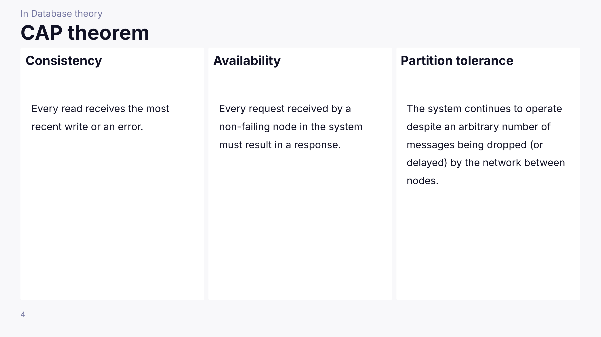

<p align="center">

</p>

# deck

`deck` is a tool for creating deck using Google Slides.

## Key concept

- **Continuous deck building**
    - Generate and modify deck iteratively.
- **Separate content and design**
    - Markdown for content, Google Slides for design.

## Usage

### Setup

#### Get and set your OAuth client ID credentials

- Create (or reuse) a developer project at https://console.cloud.google.com.
- Enable `Google Slides API` and `Google Drive API` at [`API & Services` page](https://console.cloud.google.com/apis/dashboard).
- Go to `Credentials` page and click `+ CREATE CREDENTIALS` at the top.
- Create `OAuth client ID` type of credentials.
- Choose type `Desktop app`.
- Download credentials file to `~/.local/share/deck/credentials.json` ( or `${XDG_DATA_HOME}/deck/credentials.json` ).

### Get presentation ID

#### When using an existing presentation

Get the presentation ID you want to operate. You can get a list with `deck ls`.

For example, presentation ID is `xxxxxXXXXxxxxxXXXXxxxxxxxxxx` of https://docs.google.com/presentation/d/xxxxxXXXXxxxxxXXXXxxxxxxxxxx/edit .

#### When creating a new presentation

You can create a new presentation with the deck new command and obtain the presentation ID.

If you want to apply a theme, specify the presentation ID of a presentation that is already using that theme with the `--from` option.

```console
$ deck new --from yyyyyyyYYYYyYYYYYYYyyyyyyyyy --title "Talk about deck"
xxxxxXXXXxxxxxXXXXxxxxxxxxxx
```

### Write desk in markdown

The slide pages are represented by dividing them with horizontal lines `---`.

> [!NOTE]
> The `---` at the beginning of the markdown is ignored.

### Apply desk written in markdown to Google Slides presentation

```console
$ deck apply xxxxxXXXXxxxxxXXXXxxxxxxxxxx deck.md
```

## Support markdown rules

### Insertion rule

`deck` inserts values according to the following rules regardless of the slide layout.

- Heading1 (`#`) is inserted into the title placeholder ( `CENTERED_TITLE` ) in order.
- Heading2 (`##`) is inserted into the subtitle placeholder ( `SUBTITLE` ) in order.
- All other items are inserted into the body placeholder ( `BODY` ) in order.

> [!NOTE]
> It inserts them into the placeholders in the order they appear in the markdown document, from the top of the slide (or from the left if they are the same height).

#### Input markdown document

```markdown
# CAP theorem

## In Database theory

## Consistency

Every read receives the most recent write or an error.

## Availability

Every request received by a non-failing node in the system must result in a response.

## Partition tolerance

The system continues to operate despite an arbitrary number of messages being dropped (or delayed) by the network between nodes.
```

#### Layout and placeholders


#### Result of applying



### Support syntax in body

- Bold ( `**bold**` )
- Italic ( `*italic*` `__italic__` )
- List ( `-` `*` )
- Ordered list ( `1.` `1)` )
- Link ( `[Link](https://example.com)`

### Comment

The comments `<!--` `-->` are used as a speaker notes or page config.

## Page config

If the comment `<!--` `-->` can be JSON-encoded, it will be processed as page config.

```markdown
<!-- {"layout": "title-and-body"} -->
```

### `"layout":`

It is possible to specify the page layout.

The layout name (e.g. `title-and-body`) is specified.

```markdown
<!-- {"layout": "title-and-body"} -->
```


> [!TIP]
> With `deck ls-layouts` it is possible to obtain a list of the layout names for a specific presentation.
>
> ```console
> $ deck ls-layouts xxxxxXXXXxxxxxXXXXxxxxxxxxxx
> title
> section
> section-dark
> title-and-body
> title-and-body-half
> title-and-body-2col
> title-and-body-3col
> ```

### `"freeze":`

It is possible to skip the operation of the target page.

> [!TIP]
> If you set it to a page that has been completed with layout and design, the page will not be modified unnecessarily by deck.

```markdown
<!-- {"freeze": true} -->
```

## Install

**homebrew tap:**

```console
$ brew install k1LoW/tap/deck
```

**go install:**

```console
$ go install github.com/k1LoW/deck/cmd/deck@latest
```

**manually:**

Download binary from [releases page](https://github.com/k1LoW/deck/releases)

## References

- [googleworkspace/md2googleslides](https://github.com/googleworkspace/md2googleslides): Generate Google Slides from markdown

